# DeployMind

- Multi-agent deployment automation system built with Python, Google ADK 2.3.0, Gemini 2.5 Flash Lite, and Qwen3 via Ollama/LiteLLM. 
- DeployMind automatically deploys a GitHub repository to Vercel, detects errors, classifies them, suggests fixes, validates the fixes, and opens a GitHub Pull Request for human review — all coordinated by a central orchestrator.

---

## Architecture

```
User provides GitHub repo URL
           │
           ▼
   ┌─────────────────┐
   │   Orchestrator  │  ◄── Central controller (plain Python state machine)
   └────────┬────────┘
            │
            ▼
   ┌─────────────────┐
   │ Deployment Agent│  Deploys repo to Vercel via REST API
   └────────┬────────┘  Health-checks the live URL after build
            │
     ┌──────┴──────┐
     │             │
  success        error
     │             │
     ▼             ▼
 No Error    ┌─────────────────┐
  Found      │ Log Analysis    │  Extracts last error + concise summary
             │     Agent       │  Model: Qwen3 (Ollama)
             └────────┬────────┘
                      │
                      ▼
             ┌─────────────────┐
             │ Issue Classif.  │  Categories: dependency error, build error,
             │     Agent       │  runtime error, configuration error
             └────────┬────────┘  Model: Qwen3 (Ollama)
                      │
                      ▼
             ┌──────────────────────────┐
             │ Memory Store             │  Retrieves similar past fixes (JSON)
             │ retrieve_similar_fixes() │  Injected as context into fix research
             └──────────────────────────┘
                      │
                      ▼
             ┌─────────────────┐
             │ Fix Research    │  Searches web via google_search tool
             │     Agent       │  Produces plain-text fix proposal
             └────────┬────────┘  Model: Gemini 2.5 Flash Lite
                      │
                      ▼
             ┌─────────────────┐
             │ Fix Suggestion  │  Structures research into typed output:
             │     Agent       │  {issue, category, fix, reasoning}
             └────────┬────────┘  Model: Gemini 2.5 Flash Lite
                      │
                      ▼
             ┌─────────────────┐
             │  Validation     │  Checks fix relevance and hallucination risk
             │     Agent       │  Approves or rejects
             └────────┬────────┘  Model: Qwen3 (Ollama)
                      │
              ┌───────┴───────┐
              │               │
           approved        rejected
              │               │
              ▼               ▼
        save_fix()      loop back to
        to memory       Log Analysis
              │         (max 3 retries)
              ▼
             ┌─────────────────┐
             │  Approval Agent │  Generates human-readable summary
             └────────┬────────┘  Model: Qwen3 (Ollama)
                      │
                      ▼
             ┌─────────────────────┐
             │ Patch Generation    │  Reads real repo files via GitHub API
             │     Agent           │  Generates full file_path + file_content
             └──────────┬──────────┘  Model: Gemini 2.5 Flash Lite
                        │
                        ▼
             ┌─────────────────┐
             │  GitHub PR      │  Pushes fix to new branch
             │  (auto-created) │  Opens PR for human review/merge
             └─────────────────┘
```

---

## Agents

### 1. Deployment Agent
**Model:** Qwen3 via Ollama - Tool calls only (Vercel REST API), no LLM reasoning needed
**Responsibility:** Deploys the repository's base branch to Vercel via the REST API (`POST /v13/deployments`), polls until build finishes (`GET /v13/deployments/{id}`), fetches build-time error logs (`GET /v3/deployments/{id}/events`), performs a post-deploy health check on the live URL to catch runtime errors, and queries Vercel's runtime logs API (`GET /v1/projects/{id}/deployments/{id}/runtime-logs`) on failure.

### 2. Log Analysis Agent
**Model:** Qwen3 via Ollama - Pure reasoning, no external tools
**Responsibility:** Reads the raw deployment log excerpt, finds the last and most relevant error message, and writes a concise 1-3 sentence summary suitable for the classification step.  
**Output schema:** `ErrorLog { error_message, error_summary }`

### 3. Issue Classification Agent
**Model:** Qwen3 via Ollama - Pure reasoning, fixed enum output
**Responsibility:** Takes the error summary and classifies it into exactly one of four predefined categories.  
**Categories:** `dependency error`, `build error`, `runtime error`, `configuration error`  
**Output schema:** `IssueClassification { issue, category }`

### 4. Fix Research Agent
**Model:** Gemini 2.5 Flash Lite + `google_search` - Requires `google_search` built-in tool
**Responsibility:** Uses web search to research the correct fix for the classified issue. Produces plain-text output (no structured schema) since Gemini does not allow `google_search` and `output_schema` in the same request. Also receives any relevant past fixes from the Memory Store as additional context.

### 5. Fix Suggestion Agent
**Model:** Gemini 2.5 Flash Lite - Structures research output via `output_schema`
**Responsibility:** Takes the fix research text and structures it into a typed output with `issue`, `category`, `fix`, and `reasoning` fields.  
**Output schema:** `FixSuggestion { issue, category, fix, reasoning }`

### 6. Validation Agent
**Model:** Qwen3 via Ollama - Pure reasoning, no external tools
**Responsibility:** Critically reviews the suggested fix for relevance and hallucination risk — checks whether the fix actually addresses the stated issue and whether the reasoning references real, plausible concepts. Returns `approved=True` or `approved=False` with a reason.  
**Output schema:** `ValidationResult { approved, reason }`

### 7. Approval Agent
**Model:** Qwen3 via Ollama - Pure reasoning, no external tools
**Responsibility:** Generates a clear, human-readable summary of the full diagnosis: error log, issue, category, fix, and reasoning. This summary is used as the GitHub PR description.  
**Output schema:** `ApprovalSummary { summary }`

### 8. Patch Generation Agent
**Model:** Gemini 2.5 Flash Lite - Requires GitHub API tool calls
**Responsibility:** Converts the validated fix description into a concrete code edit. Calls `list_repo_root_files()` to see which files actually exist, then `read_repo_file()` to read the target file's current content, and returns the full updated `file_path` and `file_content`.  
**Output schema:** `CodePatch { file_path, file_content }`

---

## Features

### Memory-Enabled Agent
`memory_store.py` provides persistent storage of past `(error_message, category, fix, reasoning)` tuples in `deploymind_memory.json`. Before the fix research step, the orchestrator calls `retrieve_similar_fixes()` to find past fixes with keyword-overlap similarity scoring. Matching past fixes are injected into the fix research prompt as context, allowing the agent to reuse known solutions without repeating a full web search.

### Human-in-the-Loop Approval
After the Validation Agent approves a fix, the Patch Generation Agent generates the actual code change, which is pushed to a new branch (`deploymind-fix-<timestamp>`). A GitHub Pull Request is automatically opened with the full diagnostic summary as the PR description. The human reviews and merges the PR on GitHub — that merge action is the approval step, rather than a separate Python call.

### Multi-Agent Orchestration
8 specialized agents coordinated by a central Python orchestrator, with deterministic branching (deploy success/failure), a retry loop with a hard limit of 3 validation attempts enforced in Python (not in LLM reasoning), and a model split (Qwen3/Ollama for reasoning-only agents, Gemini for tool-using agents) driven by capability requirements.

---

## Workflow

```
1) User provides GitHub repo URL
2)  Deployment Agent deploys main branch to Vercel
3)  If success → return "no error found"
4) If failure → extract build/runtime logs
5) Log Analysis Agent summarizes the error
6) Issue Classification Agent categorizes it
7) Memory Store is queried for similar past fixes
8) Fix Research Agent researches the fix (with memory context)
9) Fix Suggestion Agent structures the fix
10) Validation Agent approves or rejects
    - If rejected → back to step 5 (max 3 attempts)
    - If approved → save fix to memory
11) Approval Agent generates PR description summary
12) Patch Generation Agent reads repo, generates code edit
13) Fix is pushed to a new branch on GitHub
14) PR is opened automatically → user reviews and merges
```

---

## Setup

### Prerequisites
- Python 3.10+
- [Ollama](https://ollama.com/) running locally with Qwen3 pulled
- Google AI Studio API key (Gemini 2.5 Flash Lite)
- Vercel account with a project linked to the GitHub repo
- GitHub Personal Access Token with `repo` scope

### Install

```bash
pip install -r requirements.txt --break-system-packages
ollama pull qwen3
ollama serve
```

### Configure `.env`

```
GOOGLE_API_KEY=your_gemini_api_key
VERCEL_TOKEN=your_vercel_token
VERCEL_TEAM_ID=                          # leave blank if personal account
VERCEL_PROJECT_NAME=your_project_name
VERCEL_BYPASS_SECRET=                    # from Vercel Deployment Protection settings
HEALTH_CHECK_PATH=/api/search?topic=test # path that exercises your server code
GITHUB_REPO=owner/repo
GITHUB_TOKEN=your_github_pat
BASE_BRANCH=main
OLLAMA_API_BASE=http://localhost:11434
MEMORY_FILE=deploymind_memory.json
```

### Run

```bash
python orchestrator.py
```

---

## Structure

```
deploymind_pipeline/
├── orchestrator.py              # Central controller and entry point
├── memory_store.py              # Persistent memory for past fixes
├── schemas.py                   # Pydantic output schemas for all agents
├── demo.py                      # Demo script: 3 real deployment errors
├── requirements.txt
├── .env
└── agents/
    ├── deployment_agent.py      # Vercel deploy + health check
    ├── log_analysis_agent.py    # Error extraction and summarization
    ├── issue_classification_agent.py
    ├── fix_suggestion_agent.py  # fix_research_agent + fix_suggestion_agent
    ├── validation_agent.py
    ├── approval_agent.py
    └── patch_generation_agent.py
```

---

## Tech Stcak

- **Python 3.10+**
- **Google ADK 2.3.0** — agent framework
- **Gemini 2.5 Flash Lite** — fix research, fix structuring, patch generation
- **Qwen3 via Ollama + LiteLLM** — log analysis, classification, validation, approval
- **Vercel REST API** — deployment triggering and log fetching
- **GitHub API (PyGithub)** — repo reading, branch creation, PR creation
- **Pydantic** — structured output schemas between agents

---

## Screenshots of execution
### First- Successfull deployment
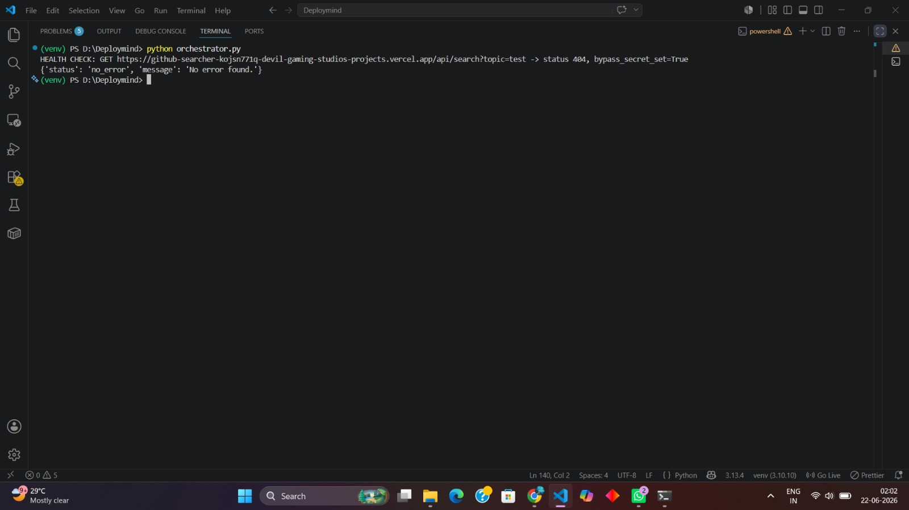
### Second- Build failed due to missing previous cache data
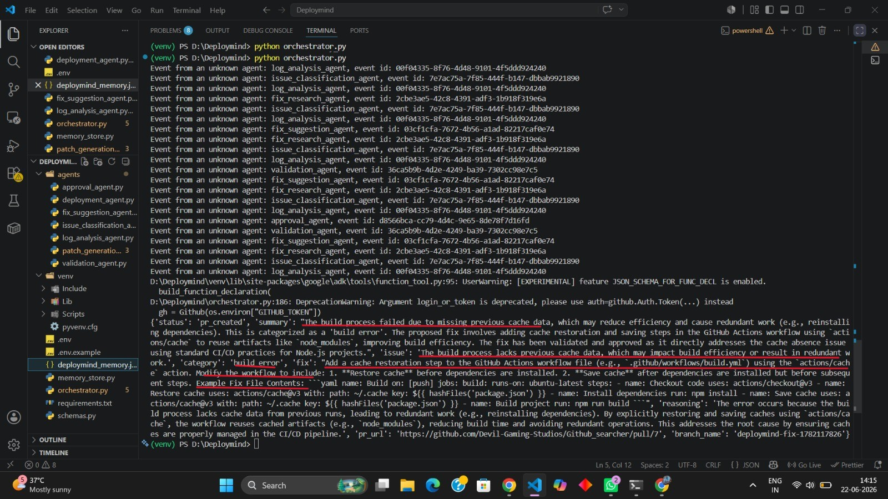
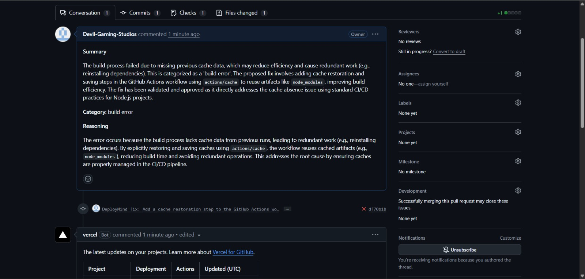
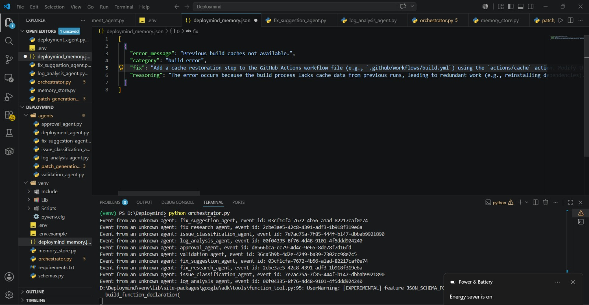
### Third- Wrong root directory
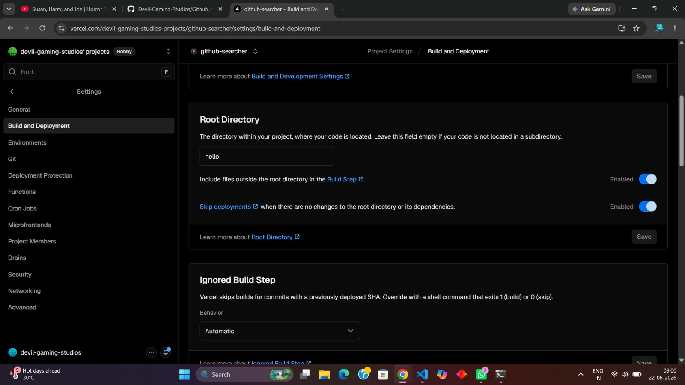
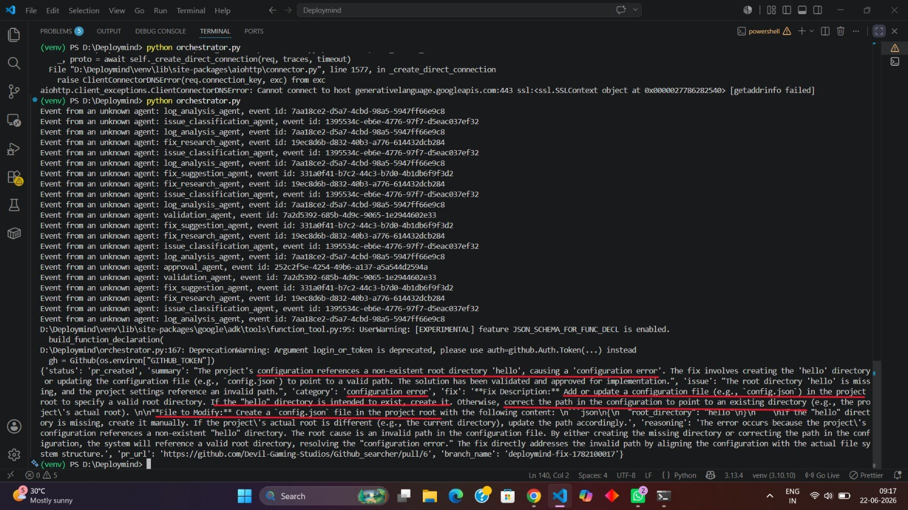
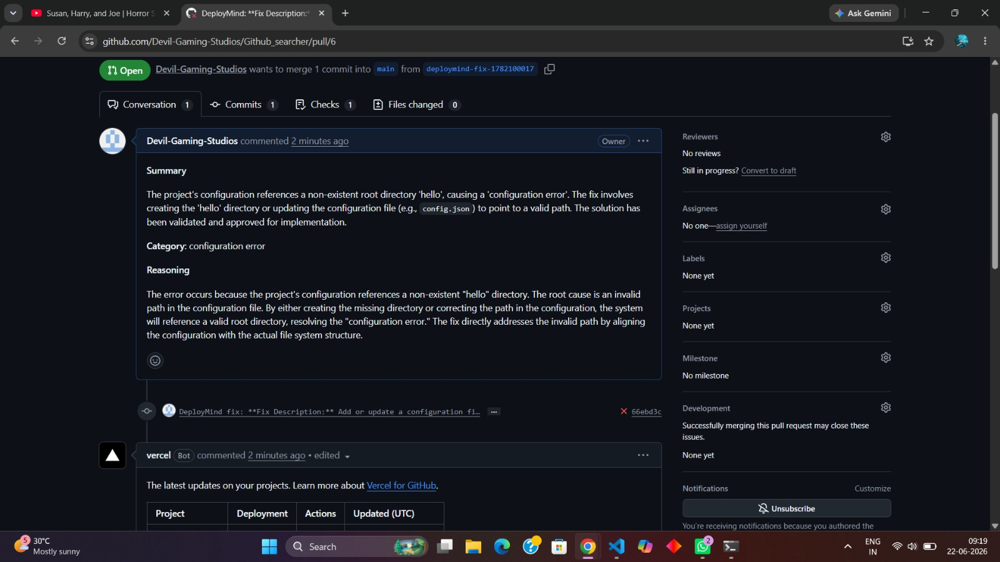
### Fourth- Empty package.json file
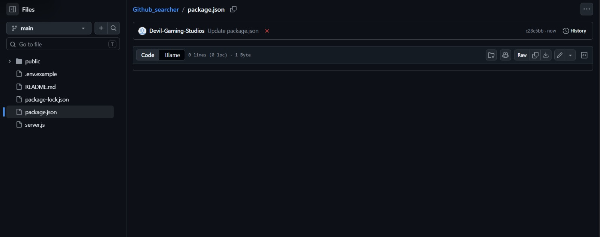
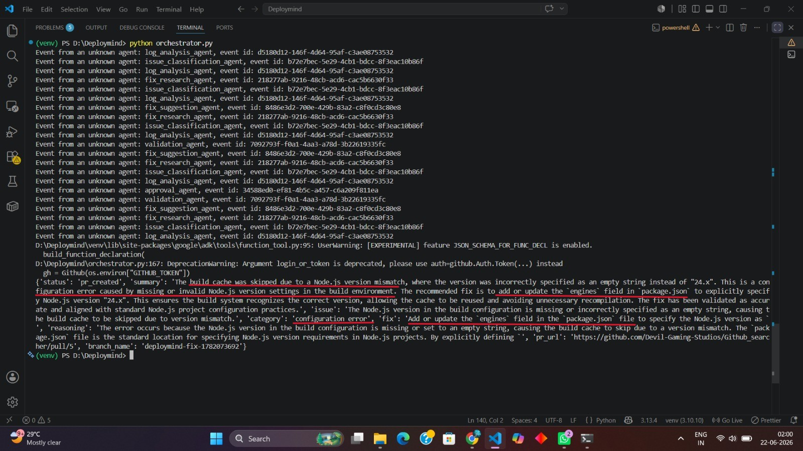
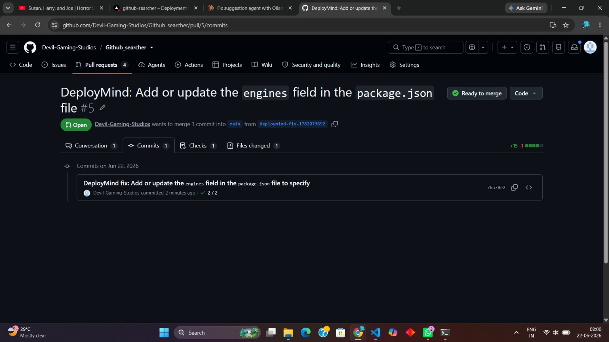
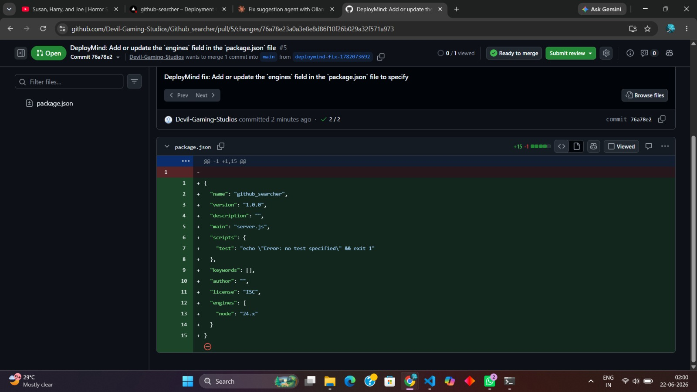
